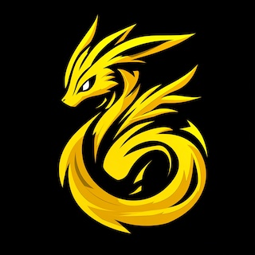
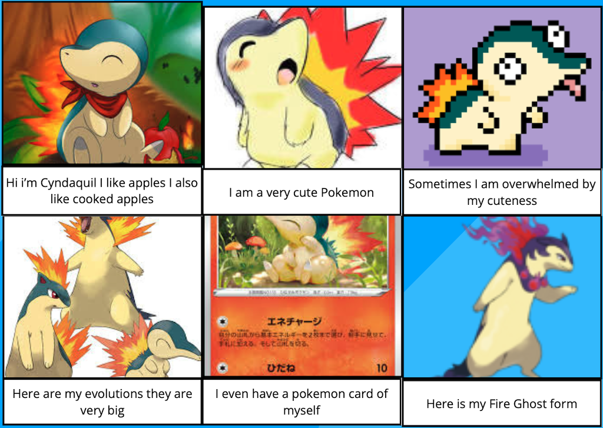

# Typhlosion

Typhlosion is a collection of random Pokémon stuffs our family play with.

## Pokémon GO

### Type Charts

[All types](docs/pokemon-type-chart/all-types.md)
[Bug type](docs/pokemon-type-chart/per-type.md#bug)
[Dark type](docs/pokemon-type-chart/per-type.md#dark)
[Dragon type](docs/pokemon-type-chart/per-type.md#dragon)
[Electric type](docs/pokemon-type-chart/per-type.md#electric)
[Fairy type](docs/pokemon-type-chart/per-type.md#fairy)
[Fighting type](docs/pokemon-type-chart/per-type.md#fighting)
[Fire type](docs/pokemon-type-chart/per-type.md#fire)
[Flying type](docs/pokemon-type-chart/per-type.md#flying)
[Ghost type](docs/pokemon-type-chart/per-type.md#ghost)
[Grass type](docs/pokemon-type-chart/per-type.md#grass)
[Ground type](docs/pokemon-type-chart/per-type.md#ground)
[Ice type](docs/pokemon-type-chart/per-type.md#ice)
[Normal type](docs/pokemon-type-chart/per-type.md#normal)
[Poison type](docs/pokemon-type-chart/per-type.md#poison)
[Psychic type](docs/pokemon-type-chart/per-type.md#psychic)
[Rock type](docs/pokemon-type-chart/per-type.md#rock)
[Steel type](docs/pokemon-type-chart/per-type.md#steel)
[Water type](docs/pokemon-type-chart/per-type.md#water)

### Team Yellow Six

We are team Yellow Six on Pokémon GO!

## Pokémon Comic

I am Cyndaquil by G10 Media.

